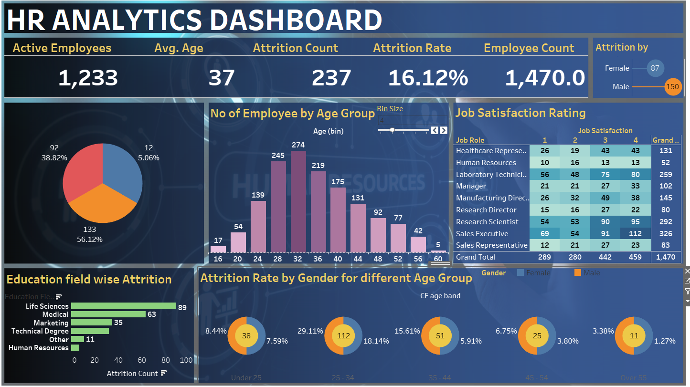

# HR Analytics Dashboard
Learnt Data Visualization and Data Analytics with Tableau by solving Realistic Analytics Projects.

  <pre>
  1. HR Analytics Dashboard
  </pre>

<h1>Screenshots</h1>

<h1>What I Learnt in Tableau :</h1>

<ul>
<li>To Create 3 interactive dashboards and publish it online to share</li>

<li>Learnt how to connect to different data sources such as Excel, Google Sheets and Cloud Servers.</li>

<li>To Create a variety of charts including bar charts, line charts, donut charts, maps, tables and dual axis charts.</li>

<li>To Create calculated fields including developing IF Statements.</li>

<li>To Create sets, hierarchies and groups.</li>

<li>Understood how joins work.</li>

<li>Understood Level Of Detail calculations.</li>

<li>To Create Parameters</li>

<li>Understood how to make use of the analytics pane including using trend lines</li>

<li>Understood how to use dashboard actions and create interactive dashboards.</li>

<li>Learnt creating a dashboard which updates daily via google sheets.</li>

</ul>
